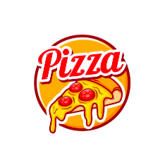
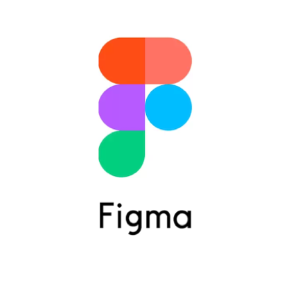

## **Pizza**

<!--    <a>-->
        
<!--    </a>-->
    
    

## **Features**
- UICollectionViewCompositionalLayout + NSDiffableDataSource api.
- Dynamic sticky section header to indicate current category.
- Asyncronous loading data via async/await.
- Storing "cached" data via FileManager.
- MVP-Coordinator design with callback-navigation.
- All code is native, no dependencies.
